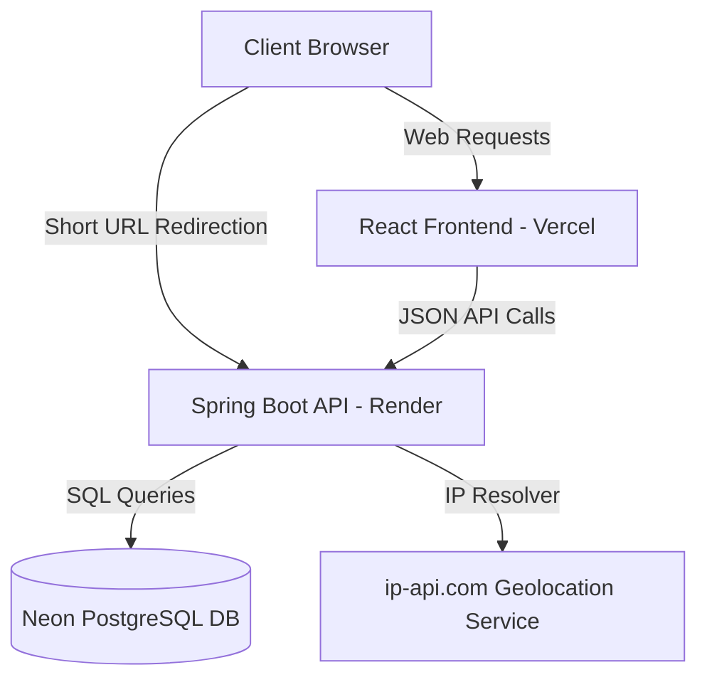

# Trimly | Enterprise SaaS URL Shortener & Analytics

Trimly is a portfolio-ready, production-grade URL shortener application engineered with a **Java 21 / Spring Boot 3** backend and a **React 19 / Vite / Tailwind CSS** frontend. It provides lightning-fast 302 redirections, dynamic vector QR codes, and real-time visitor analytics.

---

## 🚀 Key Features

* **Short Code Engine**: Automatically generates 7-character base62 codes with collision retry logic or accepts custom alphanumeric aliases.
* **Granular Visitor Analytics**: Logs browser type, operating system, platform, device form factor, language, referrer networks, and geo-locations (Country & City).
* **Security Controls**: Configure maximum redirect click triggers, set dates to self-destruct links automatically, and define tag notes.
* **Bulk Creation**: Shorten lists of destination URLs in a single request.
* **Dynamic QR Codes**: Download vectors in SVG format for print media.
* **Dark & Light Themes**: Responsive design utilizing premium CSS gradients and glassmorphism.
* **Swagger/OpenAPI Documentation**: Interactive sandbox for backend routes.

---

## 🛠️ Tech Stack

### Backend
* **Core**: Java 21, Spring Boot 3.3.1, Maven
* **Database & Persistence**: Spring Data JPA, Hibernate, PostgreSQL
* **Security**: Spring Security 6 (CORS, CSRF protection, secure HTTP headers)
* **Documentation**: Springdoc OpenAPI v2 (Swagger)
* **Testing**: JUnit 5, Mockito
* **Utilities**: Lombok, Bean Validation, SLF4J

### Frontend
* **Core**: React 19, Vite, TypeScript
* **Styling**: Tailwind CSS, shadcn/ui styles, Lucide Icons
* **State & Network**: TanStack React Query v5, Axios
* **Forms & Validation**: React Hook Form, Zod
* **Visualization & Animations**: Recharts, Framer Motion

---

## 🏛️ Architecture & Folder Structure

### Folder Structure
```
d:/url shortner/
├── backend/
│   ├── src/
│   │   ├── main/
│   │   │   ├── java/com/urlshortener/
│   │   │   │   ├── config/          # Spring Security & Swagger UI
│   │   │   │   ├── controller/      # REST API Controllers
│   │   │   │   ├── dto/             # Request & Response Transfer Objects
│   │   │   │   ├── entity/          # JPA Domain Entities
│   │   │   │   ├── exception/       # Exception definitions & Global Handler
│   │   │   │   ├── repository/      # Spring Data JPA Repository interfaces
│   │   │   │   ├── service/         # Service interfaces & Implementations
│   │   │   │   └── util/            # IP resolvers & UA parsers
│   │   │   └── resources/
│   │   │       └── application.yml  # YAML configurations
│   │   └── test/                    # JUnit 5 & Mockito test suites
│   ├── Dockerfile
│   └── pom.xml                      # Maven build descriptor
├── frontend/
│   ├── src/
│   │   ├── api/                     # Axios API base configuration
│   │   ├── components/              # Modals, Navbar, Footer, Providers
│   │   ├── hooks/                   # Custom TanStack React Query hooks
│   │   ├── lib/                     # CSS twMerge cn, date formatters
│   │   ├── pages/                   # Landing, Dashboard, Analytics, Settings
│   │   ├── App.tsx                  # Main router configuration
│   │   └── main.tsx                 # Bootstrapper entrypoint
│   ├── index.html
│   ├── package.json
│   ├── tailwind.config.js
│   └── vite.config.ts
├── docker-compose.yml               # PostgreSQL & Spring Boot compose orchestration
└── README.md                        # Documentation
```

### System Architecture


---

## 🗄️ Database Schema

### Table: `urls`
* `id` (BIGSERIAL, Primary Key)
* `original_url` (VARCHAR(2048), Not Null)
* `short_code` (VARCHAR(50), Unique, Not Null)
* `custom_alias` (VARCHAR(50), Unique, Nullable)
* `click_count` (INTEGER, Default 0)
* `max_clicks` (INTEGER, Nullable)
* `notes` (TEXT, Nullable)
* `expires_at` (TIMESTAMP, Nullable)
* `created_at` (TIMESTAMP, Not Null)
* `updated_at` (TIMESTAMP, Not Null)

### Table: `analytics`
* `id` (BIGSERIAL, Primary Key)
* `url_id` (BIGINT, Foreign Key references urls.id ON DELETE CASCADE)
* `ip_address` (VARCHAR(45))
* `browser` (VARCHAR(50))
* `operating_system` (VARCHAR(50))
* `device` (VARCHAR(50))
* `country` (VARCHAR(100))
* `city` (VARCHAR(100))
* `language` (VARCHAR(50))
* `platform` (VARCHAR(50))
* `user_agent` (VARCHAR(512))
* `referrer` (VARCHAR(1024))
* `visited_at` (TIMESTAMP, Not Null)

---

## 🔌 API Endpoints Reference

### URL Operations
* `POST /api/v1/urls` - Shorten a new destination URL.
* `POST /api/v1/urls/bulk` - Batch create multiple shortened links in one request.
* `GET /api/v1/urls` - Fetch paginated, sortable, and searchable URL registrations.
* `GET /api/v1/urls/{id}` - Retrieve details for a specific URL.
* `PUT /api/v1/urls/{id}` - Modify expiration dates, notes, aliases, and limits.
* `DELETE /api/v1/urls/{id}` - Delete URL registration and its visitor logs.

### Redirection & Analytics
* `GET /{shortCode}` - Resolves and logs click analytics, then issues a 302 Found redirect.
* `GET /api/v1/stats` - Fetch global system stats counters and metrics distributions.
* `GET /api/v1/stats/{shortCode}` - Fetch stats distributions specifically for one link.
* `GET /health` - Liveness health check endpoint.

---

## ⚙️ Environment Variables

### Backend (`.env` or Config Vars)
| Variable | Description | Default Fallback |
| :--- | :--- | :--- |
| `PORT` | Local service port | `8080` |
| `DB_HOST` | Database server address | `localhost` |
| `DB_PORT` | Database server port | `5432` |
| `DB_NAME` | Database schema name | `url_shortener` |
| `DB_USER` | Database user name | `postgres` |
| `DB_PASSWORD` | Database user password | `postgres` |
| `DATABASE_URL` | Complete DB connection string (Neon PG format) | *Constructed dynamically from hosts* |
| `APP_BASE_URL` | Base URL used to build shortened strings | `http://localhost:8080` |

### Frontend (`.env`)
| Variable | Description | Default Fallback |
| :--- | :--- | :--- |
| `VITE_API_BASE_URL` | Backend service base address | `http://localhost:8080` |

---

## 💻 Local Setup Guide

### Running with Docker Compose (Recommended)
1. Ensure Docker Desktop is installed.
2. From the root directory, build and launch containers:
   ```bash
   docker-compose up --build
   ```
3. The backend API is available at `http://localhost:8080` and the database container is exposed at port `5432`.

### Manual Development Setup

#### Backend Setup
1. Open a terminal and navigate to the backend folder:
   ```bash
   cd backend
   ```
2. Build and run unit tests with Maven:
   ```bash
   mvn clean test
   ```
3. Run the Spring Boot application:
   ```bash
   mvn spring-boot:run
   ```

#### Frontend Setup
1. Open a terminal and navigate to the frontend folder:
   ```bash
   cd frontend
   ```
2. Install package dependencies:
   ```bash
   npm install
   ```
3. Boot the Vite development server:
   ```bash
   npm run dev
   ```
4. Access the web app in your browser at `http://localhost:3000`.

---

## 🌐 Deployment Details

### Database (Neon PostgreSQL)
1. Provision a free database instance on [Neon](https://neon.tech).
2. Copy the connection connection URI pool link.

### Backend (Render)
1. Link your GitHub repository to [Render](https://render.com).
2. Select **Web Service**, configure the runtime environment to **Docker**, and point to the `backend` subdirectory context.
3. Define configuration environment variables matching the database settings.

### Frontend (Vercel)
1. Connect your repository to [Vercel](https://vercel.com).
2. Set the root directory context to `frontend`.
3. Set the build command to `npm run build` and output folder to `dist`.
4. Configure `VITE_API_BASE_URL` pointing to the Render backend service address.

---

* **Swagger API Endpoint Docs**: `http://localhost:8080/swagger-ui.html`
* **Live Demo**: *[Pending Deployment]*
* **Screenshots**: *[Pending]*
